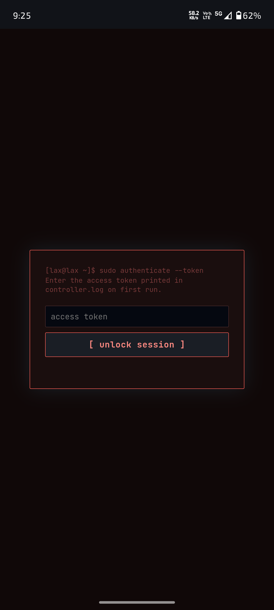
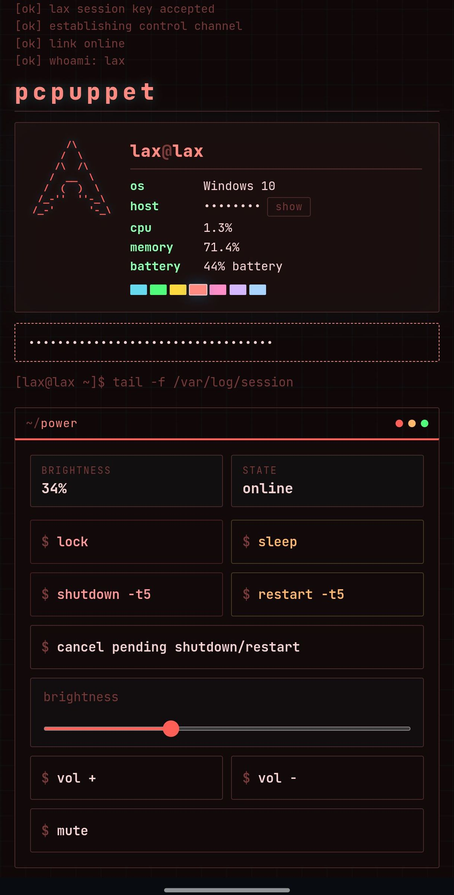
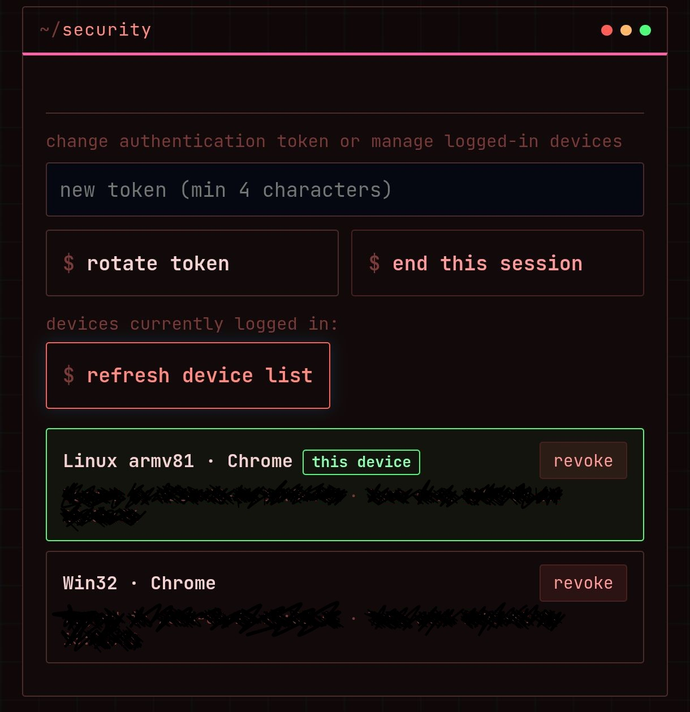

# pcpuppet 

## Control Your Windows PC from Your Phone

A lightweight self-hosted remote control panel for your own Windows laptop.
Runs quietly in the background (no console window), exposes a small web
dashboard styled like a terminal, and tunnels it to the internet via ngrok
so you can reach it from your phone.

Lock, sleep, shutdown/restart, adjust volume & brightness, sync the
clipboard, pop up an on-screen message, take a screenshot, or close an
open window — all from your browser.

## Screenshots

| Login | Dashboard |
|---|---|
|  |  |

| Features | Processes & Security |
|---|---|
|  |     |

## Features

- **No console window** — detaches on startup, runs via `waitress`, logs to file
- **System tray icon** — open dashboard, copy token, restart tunnel, exit
- **Per-device sessions** — log in once per device, revoke access per-device
- **Second password gate** for extra-sensitive actions
- **Every action is sandboxed** — one failing feature (e.g. no battery, no
  `pycaw`) never takes the rest of the app down

## Setup

1. Put `laptop_controller.py`, `requirements.txt`, `setup.bat`, and
   `startup_launcher.vbs` in the same folder.
2. Double-click **`setup.bat`** once — installs all dependencies.
3. (Optional, for remote access) Make sure `ngrok.exe` is on your PATH, or
   set an `NGROK_PATH` environment variable pointing to it.
4. Double-click **`startup_launcher.vbs`** to start the app. No window
   appears — look for the `>_` icon in your system tray.
5. Right-click the tray icon → **Open Dashboard**, or check
   `controller.log` for your access token and open it manually.

**Auto start at login:** press `Win+R` → `shell:startup` → drop a shortcut
to `startup_launcher.vbs` in that folder.

## Where things live

Everything generated at runtime — your token, session data, and logs —
lives outside the repo, in `%LOCALAPPDATA%\LaptopController\`:

| File | Contents |
|---|---|
| `config.json` | your access token + local security password |
| `sessions.json` | active device sessions |
| `controller.log` | full activity log, including your token on first run |

## Changing the access token or security password

Just edit (or delete) `config.json` in `%LOCALAPPDATA%\LaptopController\`
and restart the app:

- **Delete the file entirely** → a brand new random token and password are
  generated on next launch.
- **Edit `"token"` or `"security_password"` directly** → set your own
  values, save, restart.

## Adding your own features

The whole app is one file, organized in numbered sections
(`# --- 1. Logging`, `# --- 2. Config`, etc.), which makes it easy to find
where to plug something in. To add a new remote action:

1. **Add a case to `execute_command()`** (search for `elif command ==`) —
   this is where `lock`, `sleep`, `shutdown`, etc. all live. Follow the same
   pattern: read `param` from the request if you need input, do the thing,
   return a `jsonify(...)` response.
2. **Add a button to `HTML_TEMPLATE`** — find the relevant `.win` panel (or
   add a new one) and add a button calling `sendCommand('your_command')`
   from the `<script>` section.
3. Wrap anything that touches an optional dependency (like `sbc` or `gw`)
   in the `@safe(...)` decorator, or check `if xyz is None:` first — this
   keeps one broken feature from crashing the whole app on machines missing
   that dependency.

**Need a new standalone endpoint instead?** Add a new `@app.route(...)`
function next to the existing ones (`/api/status`, `/api/apps`, etc.) — auth
is handled globally by `check_auth()`, so any new route is protected
automatically unless you explicitly exempt it there.

**Want a new optional dependency?** Import it in a `try/except` block like
`screen_brightness_control` or `pygetwindow` are, set it to `None` on
failure, and add it to `requirements.txt`.

## Ideas for features you could add

A few things that would slot into the existing structure without much
rework:

- **Change Windows password** — a new branch in execute_command() for "change_password" 
  that runs `net user <username> <new_password>` hidden (no console window, no shell exposure) 
  so you can reset a Windows user's password from your phone. Requires admin privileges.
- **File browser / file transfer** — a new `/api/files` route using
  `os.listdir` + `send_file` to browse and download files from your PC, or
  upload files to it. Add a `.win` panel with a folder list and an
  `<input type="file">`.
- **Webcam snapshot** — same pattern as `take_screenshot_bytes()`, but
  grabbing a frame from `cv2.VideoCapture(0)` instead of `ImageGrab.grab()`.
  Handy as a "who's at my desk" check.
- **Run arbitrary shortcuts/scripts** — a dropdown of pre-approved `.bat` /
  `.exe` paths (don't accept freeform shell input from the client — keep it
  to a fixed whitelist you define server-side) so you can trigger things
  like "open VS Code" or "start backup script" remotely.
- **Battery/CPU alert push** — a background thread that checks
  `psutil.sensors_battery()` / `psutil.cpu_percent()` on a timer and, if a
  threshold is crossed, calls `show_popup_message()` or pings a service like
  Pushover/ntfy so your phone gets notified without you opening the dashboard.
- **Scheduled actions** — add a `schedule` (pip package) job or a simple
  timer thread so you can queue "lock at 11pm" or "shutdown in 2 hours" from
  the dashboard, instead of only the fixed `-t 5` in `execute_command()`.
- **Multi-factor for dangerous commands** — require the `security_password`
  (not just the session token) specifically for `shutdown`/`restart`, by
  checking it inside those branches of `execute_command()` — right now the
  second password only guards `/api/security/unlock`, not individual
  commands.

If you build one of these, it'll fit the same pattern described above: a
branch in `execute_command()` (or a new route) plus a button/panel in
`HTML_TEMPLATE`.

## Security notes

- This exposes real control over your PC to anyone with the token — treat
  the token like a password.
- The ngrok URL is public by default; anyone who has both the URL and the
  token can reach the dashboard. Revoke sessions you don't recognize from
  the dashboard, or regenerate the token if you suspect it's leaked.
- If `pystray` fails to load (missing tray icon support), the app still runs
  headless in the background — you just won't get a tray icon; use Task
  Manager to stop it (`pythonw.exe`), or add a stop mechanism of your choice.
- Samajhne wale ko ishara ☕

## Requirements

See `requirements.txt`. Optional features degrade gracefully if a package
is missing — you'll just lose that one feature (e.g. no `pycaw` → no volume
control, falls back to media-key simulation).

## License
MIT

## Author
Prasad
